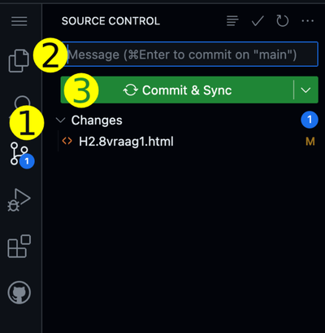

# Website PO uit Fundament 
Template voor het maken van de website PO uit \
[Fundament Kernprogramma A: Vaardigheden 2. HTML & CSS hoofdstuk 5](https://fundament-online.nl/leeromgeving/hoofdstuk.php?id=12181)

Deze praktische opdracht maak je als volgt:
1. Je zorgt dat iedereen uit je groepje evenveel code maakt en je bewaart je werk elke les in GitHub.
2. In _paragraaf 5.2. Voorbereiding_ start je met coderen in dit template. Doe eerst stap 1 tot en met stap 5 uit deze README. Doe daarna wat aangegeven staat in paragraaf 5.2. Maak geen map _eindopdracht_, maar zet je bestanden in de hoofdmap van de Codespace.
3. In _paragraaf 5.3_ tot en met _paragraaf 5.6_ werk je aan de basis van je website. Je maakt alle opdrachten in deze paragrafen.
4. Daarna maak je uitbreidingen aan je website die je zelf verzint. Je mag het soort eten dat je verkoopt aanpassen, maar de meeste punten verdien je natuurlijk met nette html en css waarvan je zelf hebt uitgezocht hoe het werkt.
5. Tot slot voeg je een samenvatting in pdf toe van 
[Fundament Kernprogramma E: Architectuur -> Security (E2)](https://fundament-online.nl/leeromgeving/hoofdstuk.php?id=10504)
6. De inleverdatum staat in de planner. Je docent kijkt na wat er op de deadline in GitHub staat.

## 1. Bekijk code

- Open een Codespace
- Start een webserver in de terminal van de Codespace met het commando 
    ```
    npx -y vite
    ```
- Als je het commando knipt en plakt, dan verschijnt er de eerste keer links bovenin je scherm een popup waarin je toestemming moet geven.
- Om het commando uit te voeren druk je op de [Enter]-toets.
- Een popup verschijnt met de vraag of je een browser wilt openen verschijnt rechtonder in je scherm. Klik op de groene knop "In Browser Openen".
- Je ziet de inhoud van het `index.html` bestand in het geopende browserwindow. Klik op de link van de eerste opdracht om het resultaat te zien.

## 2. Maak nieuwe opdracht

- Maak een volgende opdracht van \
    [Fundament Kernprogramma A: Vaardigheden 2. HTML & CSS (2025) hoofdstuk 5](https://fundament-online.nl/leeromgeving/hoofdstuk.php?id=12181)

## 3. Bekijk het resultaat

- De aanpassingen worden automatisch in het browser-window getoond    

## 4. Bewaar je werk in GitHub

- Klik op het icoontje met de twee streepjes en 3 bolletjes (1)
- Type bij "Message" de opdracht waaraan je gewerkt hebt en enkele woorden wat je gedaan hebt (2)
- Klik op "Commit & Sync" (3)
  


## 5. Problemen oplossen

- Meer informatie over GitHub met Codespaces \
    https://stanislas.informatica.nu/help/codespaces
